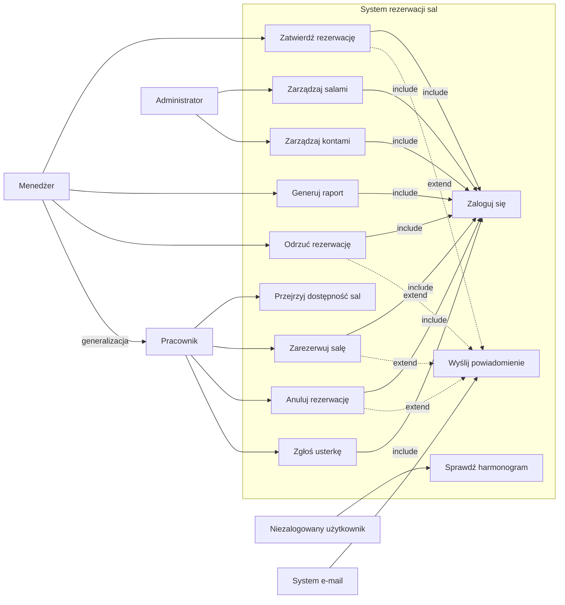

```mermaid
graph LR
  subgraph SYS["System rezerwacji sal"]
    UC1["Przejrzyj dostępność sal"]
    UC2["Zarezerwuj salę"]
    UC3["Anuluj rezerwację"]
    UC4["Zatwierdź rezerwację"]
    UC5["Zaloguj się"]
    UC6["Zarządzaj salami"]
    UC7["Generuj raport"]
    UC8["Zgłoś usterkę"]
    UC9["Wyślij powiadomienie"]
    UC10["Zarządzaj kontami"]
    UC11["Odrzuć rezerwację"]
    UC12["Sprawdź harmonogram"]
  end

  N["Niezalogowany użytkownik"] --> UC12

  P["Pracownik"] --> UC1
  P --> UC2
  P --> UC3
  P --> UC8

  M["Menedżer"] --> UC4
  M --> UC7
  M --> UC11
  M -->|generalizacja| P

  A["Administrator"] --> UC6
  A --> UC10

  E["System e-mail"] --> UC9

  UC2 -->|include| UC5
  UC3 -->|include| UC5
  UC4 -->|include| UC5
  UC6 -->|include| UC5
  UC7 -->|include| UC5
  UC8 -->|include| UC5
  UC10 -->|include| UC5
  UC11 -->|include| UC5

  UC2 -.->|extend| UC9
  UC3 -.->|extend| UC9
  UC4 -.->|extend| UC9
  UC11 -.->|extend| UC9
```
